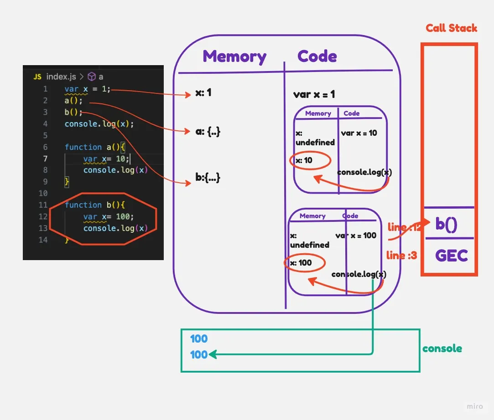

# How functions work in JS & Variable Environment

## How functions work in JavaScript ❤️

* Each Functions in JavaScript create their own a fresh execution contexts when invoked. When JavaScript invokes a function, the engine:
   1. Creates a new Execution Context (EC) for that function
   2. Pushes it onto the Call Stack
   3. Runs Phase 1 (memory allocation) for that EC — local variables start as *undefined*
   4. Runs Phase 2 (code execution) — assignment and logic runs
   5. Returns the result; the EC is popped from the Call Stack and destroyed
* *Variable Environments Are Isolated* Each function's EC has its own variable environment (Memory Component), allowing the use of local variables that are scoped within the function. for *example* - A variable named *x* in one function call has no connection to a variable named *x* in another call — even if they're calls to the same function. They live in separate memory spaces.This isolation is fundamental to how scope and closures work in JavaScript
    **Variable Environment:**
    1. The variable environment (Memory Component) of an execution context is the space where variables and functions are stored during runtime.
    2. Each execution context has its own variable environment (Memory Component), which holds the variables and functions specific to that context.
    3. When a variable is accessed, JavaScript searches for its value first in the local variable environment and then in the outer variable environments until it reaches the global variable environment.
    4. This hierarchical structure of variable environments allows for lexical scoping, where variables are resolved based on their proximity to the current execution context.
* Variables declared within a function are accessible only within that function, unless explicitly returned or accessed from an outer scope ( This is possible through the concept of closures in JavaScript-[will come in later Ep])[*Global Execution Context (GEC)*
    When a JS program starts, a Global Execution Context is created automatically. It is the outermost context(bottommost context on the Call Stack). Everything at the top level of your script runs inside the GEC.

*...Each Function calls create ECs on top of the GEC — those ECs can reference the GEC's variables (via scope chain), but the GEC cannot reach into a function's local EC*].

* JavaScript uses a process called variable hoisting, which allows functions to be called before they are defined. The variable declarations are moved to the top of their respective scopes during the compilation phase.

* Code Example:

    ```javascript
    //Example 1:
        // From Lecture Code 02 - Function in Javascript.js
        var x = 1;

        a(); // call the functions declaration before defining(phase 2) them — works due to hoisting
        b();
        console.log(x); // 1

        function a() {
            var x = 10; // local to a()'s EC
            console.log(x); // 10
        }

        function b() {
            var x = 100; // local to b()'s EC
            console.log(x); // 100
        }
        //Output
        // 10
        // 100
        // 1
    ```

* What happens step by step:

*GEC created:(phase 1)*
    GEC's Memory: { x: undefined, a: fn a, b: fn b }

*Code execution:(phase 2)*
    x = 1 (replace undefined and get assigned)
    a() called → EC_a created → pushed onto stack
        EC_a local Memory: { x: undefined } (*during EC_a's phase 1*)
        EC_a Code: x = 10; console.log(x) → prints 10 (*during EC_a's phase 2*)
        EC_a returned → popped off stack, deleted
    b() called → EC_b created → pushed onto stack
        EC_b local Memory: { x: undefined } (*during EC_b's phase 1*)
        EC_b Code: x = 100; console.log(x) → prints 100 (*during EC_b's phase 2*)
        EC_b returned → popped off stack, deleted
    console.log(x) → uses *GEC's x = 1* → prints 1

