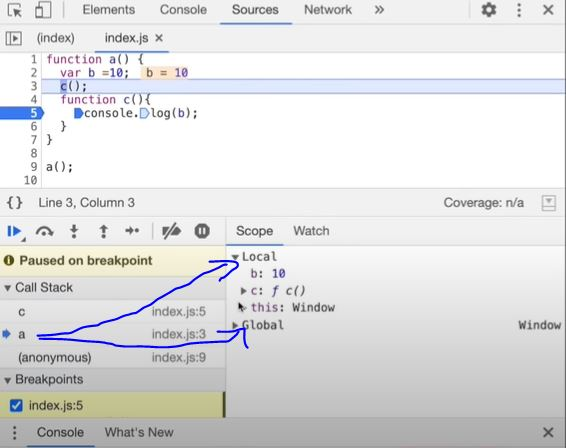

# The Scope Chain, Scope & Lexical Environment

## Scope

*Scope* defines the region of code where a variable is accessible. Variables declared in a function are scoped to that function; variables in the GEC are globally scoped.

* *Scope* in Javascript is directly related to *Lexical Environment*.

## Scope Chain

* When JavaScript encounters a variable name, it looks for it:
   1. First in the *local memory* of the current EC
   2. If not found, follows the **parent reference** to the parent's Lexical Environment
   3. Keeps going up the chain until it finds the variable or reaches the GEC
   4. If not found in GEC either → *ReferenceError*
* This traversal is the *Scope Chain* (also called the *Lexical Environment Chain*). The process of going one by one to parent and checking for values is called *scope chain or Lexcial environment chain*.

    ```javascript
        function a() {
            function c() {
                // logic here
            }
        c(); // c is lexically inside a
        } // a is lexically inside global execution
    ```

* Let's observe the below examples:

    ```javascript
    // CASE 1
    function a() {
        console.log(b); // 10
        // Instead of printing undefined it prints 10, So somehow this a function could access the variable b outside the function scope.
    }
    var b = 10;
    a();

    // CASE 2
    function a() {
    c();
    function c() {
        console.log(b); // 10
    }
    }
    var b = 10;
    a();  
    
    // CASE 3
    function a() {
        c();
        function c() {
        var b = 100;
        console.log(b); // 100
        }
    }
    var b = 10;
    a();
    
    // CASE 4
    function a() {
        var b = 10;
        c();
    function c() {
        console.log(b); // 10
        }
    }
    a();
    console.log(b); // Error, Not Defined
    ```

* Let's try to understand the output in each of the cases above.
    1. In **case 1**: function a is able to access variable b from Global scope.
    2. In **case 2**: 10 is printed. It means that within nested function too, the global scope variable can be accessed.
    3. In **case 3**: 100 is printed meaning local variable of the same name took precedence over a global variable.
    4. In **case 4**: A function can access a global variable, but the global execution context can't access any local variable.

To summarize the above points in terms of execution context:

* call_stack = [GEC, a(), c()]
Now lets also assign the memory sections of each execution context in call_stack.
* c() = [[lexical environment pointer pointing to a()]]
* a() = [b:10, c:{}, [lexical environment pointer pointing to GEC]]
* GEC =  [a:{},[lexical_environment pointer pointing to null]]

## Lexical Environment

* Whenever an Execution Context is created, a Lexical environment(LE) is also created. Every Execution Context has a Lexical Environment. The GEC's Lexical Environment has a parent reference of *null* (it has no parent).
    1. *Lexical Environment* = *local memory* + *lexical env of its parent*. Hence, Lexical Environement is the local memory along with the lexical environment of its parent
    2. *Lexical or Static scope* refers to the accessibility of variables, functions and object based on physical location in source code.

    ```javascript
        Global {
        Outer {
            Inner
        }
    }
    // Inner is surrounded by lexical scope of Outer

    function outer() {
    var x = 10;
    function inner() {
        console.log(x); // inner is lexically inside outer → can access x
    }
    inner();
    }
    outer(); // 10
    ```

## Global Scope

* Variables declared at the top level (in the GEC) have global scope. They are accessible from anywhere in the program — from any function, any nested function, through the scope chain.

## Function Scope vs Block Scope

* *var* is function-scoped — a *var* inside a function is not accessible outside it, but is accessible anywhere within the function
* *let* and *const* are block-scoped — they are scoped to the nearest *{ }* block

## Code Example

```javascript
// From Lecture Code 04 - Scope and Lexical Environment.js

function a() {
  var x = 10;  // x is in a()'s local memory

  c(); // call c from inside a — but scope is determined by WHERE c is defined!
}

function c() {
  // c is defined at the global level (lexically)
  // so it can only access global variables
  console.log(x); // ReferenceError: x is not defined
                  // x is local to a(), not accessible to c() even though c() was called from a()
}

a();


//  Contrast — lexical nesting:

function outer() {
  var x = 10;

  function inner() {
    // inner is defined INSIDE outer — so it has access to outer's scope
    console.log(x); // 10 — works! x is in the parent lexical environment
  }

  inner();
}

outer();

/*Scope chain lookup:
Looking up 'x' inside inner():
  1. inner()'s local memory → not found
  2. outer()'s lexical environment → found! x = 10
  Result: 10*/
```

## Note

An inner function can access variables which are in outer functions

* The Rule (Looking Up): A child function sitting inside a parent function can look "out" and see the parent's variables.
* The Restriction (Looking In/Sideways): A parent function cannot look "inside" its child function. Similarly, two sibling functions sitting side-by-side cannot look into each other.

    ```javascript
    function parent() {
        let houseSecrets = "I am a parent variable";

        function child() {
            // This works! The child can look UP and see the parent's variables.
            console.log(houseSecrets); 
        }
        child();
    }
    parent();
    ```

## *In Sort*

* Every Execution Context creates a Lexical Environment = local memory + parent reference
* The Scope Chain is the chain of Lexical Environments from inner to outer
* JavaScript uses lexical (static) scope — scope is determined at write-time, not call-time
* Variable lookup walks up the scope chain; failure to find results in *ReferenceError*
* *var* is function-scoped; let/const are block-scoped
* The GEC's Lexical Environment parent reference is *null* — it's the top of the chain



