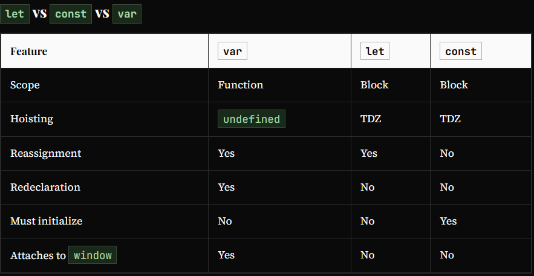

# *let* & *const* in JS, Temporal Dead Zone

*let* and *const* are hoisted differently from *var* — they live in a Temporal Dead Zone until their declaration line, making early access a *ReferenceError*.

## How *let* and *const* Are Hoisted

All three — *var*, *let*, and *const* — are hoisted. But they differ in where they are stored and whether they are accessible:

* *var* → stored in the **global object**(*window*) memory; initialized to *undefined*[You can observe this in browser DevTools: *var* variables appear in the global scope]
* *let*/*const* → stored in a separate memory space[called script - where it can be accessed only after assigning(after reached declaration line)] (not on *window*); placed in the *Temporal Dead Zone* → **Temporal Dead Zone(TDZ)**: The *Temporal Dead Zone* is the period from when a *let*/*const* variable is hoisted to when its declaration line is executed. During this time, the variable exists in memory but cannot be accessed.

   ```text
   TDZ starts: (beginning of scope – variable is hoisted)
       ... code before the declaration ...
   TDZ ends: (the let/const declaration line is reached)
       ... variable is now accessible ...
   ```

   ```javascript
   //TDZ starts
    console.log(a); // ReferenceError: Cannot access 'a' before initialization → it's in Temporal Dead Zone
    console.log(b); // prints undefined as expected
    let a = 10; // → TDZ ends
    console.log(a); // 10
    var b = 15;
    console.log(window.a); // undefined[hare *a* is not a property of window, asking for window.a = asking for window.anythingRandom]
    console.log(window.b); // 15
   ```

It looks like *let* isn't hoisted, but it is, let's understand:

* Both *a* and *b* are actually initialized as *undefined* in hoisting stage. But *var b* is inside the storage space of *GLOBAL*, and *let a* is in a separate memory object called *script*, where it can be accessed only after assigning some value to it first ie. one can access *'a'* only if it is assigned. Thus, it throws *Reference error*.

* **Types of Error: *Reference*, *Syntax*, and *Type***
  1. ReferenceError — accessing before initialization (TDZ)
  2. ReferenceError — variable not declared at all
  3. SyntaxError — *const* without initialize
  4. SyntaxError — redeclaring *let* in same scope
  5. TypeError — reassigning *const*

    ```javascript
    // ReferenceError Example 1: accessing before initialization (TDZ)
        console.log(a); // ReferenceError: Cannot access 'a' before initialization
        let a = 10;

    // ReferenceError Example 2: variable not declared at all
        console.log(b); // ReferenceError: b is not defined
        // b was never declared   
    
    // SyntaxError Example 3: const without initialize
        const d = 5;
        d = 10; // TypeError: Assignment to constant variable 
        
    // SyntaxError Example 4: redeclaring *let* in same scope
        let x = 5;
        let x = 10; // SyntaxError: Identifier 'x' has already been declared    
    
    // TypeError Example 5: reassigning *const*
        const d = 5;
        d = 10; // TypeError: Assignment to constant variable    
    ```

* **Block Scope**: *let* and *const* are scoped to the nearest *{ }* block — not just function bodies. This includes *if*, *for*, *while*, and any standalone *{ }* block.

    ```javascript
        {
          let x = 10;  // only accessible         inside this block
          const y = 20;
        }
        console.log(x); // ReferenceError: x is not defined
        console.log(y); // ReferenceError: y is not defined    
    ```

* *Let* is a stricter version of *var*. Now, *const* is even more stricter than *let*.

    ```javascript
        let a;
        a = 10;
        console.log(a) // 10. Note declaration and assigning of a is in different lines.
        ------------------
        const b;
        b = 10;
        console.log(b); // SyntaxError: Missing initializer in const declaration. (This type of declaration won't work with const. const b = 10 only will work)
        ------------------
        const b = 100;
        b = 1000; //this gives us TypeError: Assignment to constant variable.
    ```



## SOME GOOD PRACTICES

* Try using *const* wherever possible.
* If not, use *let*, Avoid *var*.
* Declare and initialize all variables with let to the top to avoid errors to shrink temporal dead zone window to zero.
* To avoid TDZ-related bugs, always declare variables at the top of their scope
