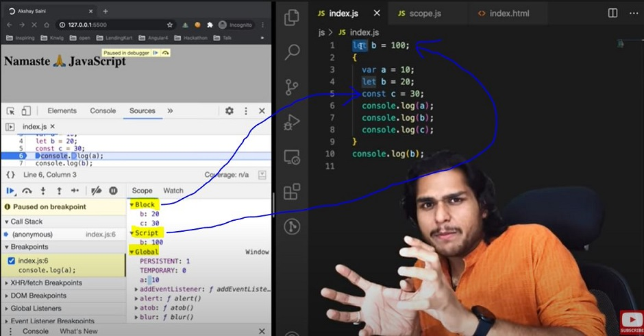
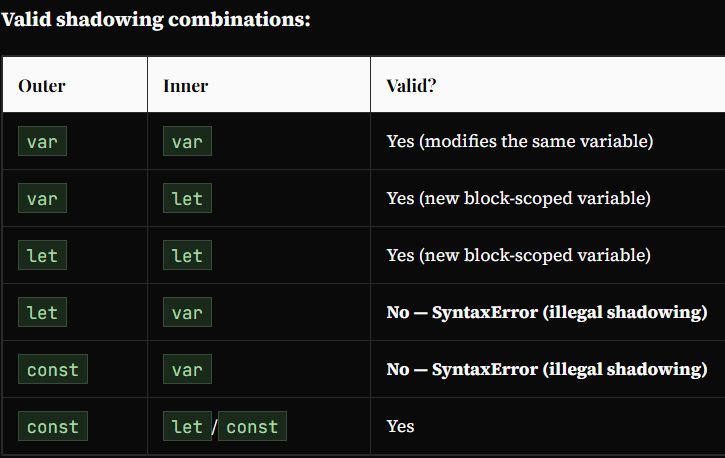

# Block Scope & Shadowing in JS

## What is a Block?

A **block** (also called a compound statement) is a pair of curly braces *{ }* used to group multiple JavaScript statements together. Blocks are used in *if*, *for*, *while*, *function* bodies — and can also be written standalone.

* Variables declared with *let* and *const* are scoped to the nearest *{ }* block — not just function bodies. This includes *if*, *for*, *while*, and any standalone *{ }* block. Are only accessible within that block. They are not visible outside it.

    ```javascript
    {
      let a = 10;
      const b = 20;
      var c = 30;
    }

    console.log(c); // 30  — var is NOT block-scoped (function/global scoped)
    console.log(a); // ReferenceError: a is not defined
    console.log(b); // ReferenceError: b is not defined
    ```

* In browser DevTools: *let/const* in a block appear in a separate "Block" scope, while *var* appears in the enclosing function/global scope.

## What is Shadowing?

Shadowing occurs when a variable declared in an inner scope has the same name as a variable in an outer scope. The inner variable "shadows" (temporarily hides) the outer one within that inner scope.

  ```javascript
  // Example 1
  var x = 1; // outer

  {
    var x = 2; // shadows outer x — but both are the SAME variable (var is not block-scoped)
    console.log(x); // 2
  }
  console.log(x); // 2  — outer x was modified!

  // Example 2

  var a = 100;
  {
    var a = 10; // same name as global var
    let b = 20;
    const c = 30;
    console.log(a); // 10
    console.log(b); // 20
    console.log(c); // 30
  }
  console.log(a); // 10, instead of the 100 we were expecting. So block "a" modified val of global "a" as well. In console, only b and c are in block space. a initially is in global space(a = 100), and when a = 10 line is run, a is not created in block space, but replaces 100 with 10 in global space itself.
  ```

* So, If one has same named variable outside the block, the variable inside the block shadows the outside variable. **This(Shadowing) happens only for var**

* Let's observe the behaviour in case of let and const and understand it's reason.

  ```javascript
  let b = 100;
  {
    var a = 10;
    let b = 20;
    const c = 30;
    console.log(b); // 20
  }
  console.log(b); // 100, Both b's are in separate spaces (one in Block(20) and one in Script(another arbitrary mem space)(100)). Same is also true for *const* declarations.
  ```



**What is Illegal Shadowing?**
  
  ```javascript
  let a = 20;
  {
    var a = 20;
  }
  // Uncaught SyntaxError: Identifier 'a' has already been declared
  ```

* We cannot shadow *let* / *const* with *var*
* But it is valid to shadow a *let* using a *let*.
* However, we can shadow *var* with *let*.


## Note

**What is scope?**
*Scope* defines the region of code where a variable is accessible. Variables declared in a function are scoped to that function; variables in the GEC are globally scoped.
